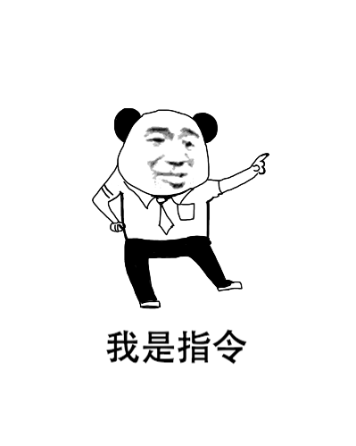
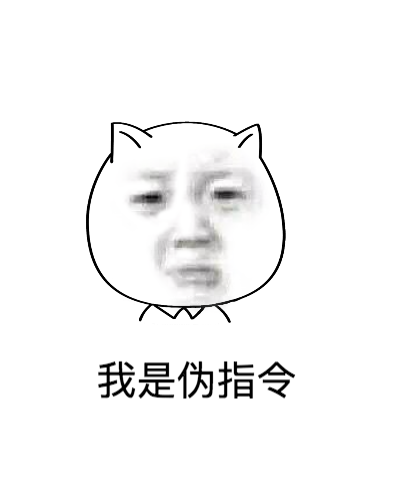
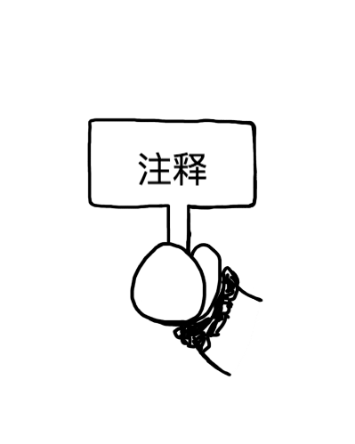

# GAB

> 图解汇编基础

## 基础

汇编语言的元素

- 指令

- 伪指令

- 标签

- 注释

## 文档

[英文文档](README.md)

## 代码章节

### [章节1](./section1)

- [function-call.c](./section1/function-call.c) 

- [function-call1-craft.s](./section1/function-call1-craft.s) 
