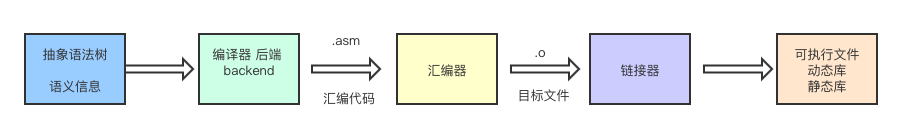
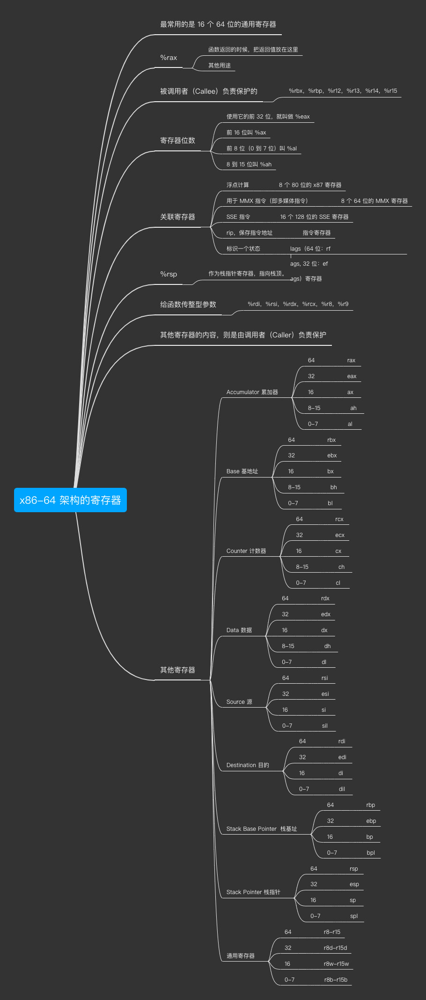

# GAB

> 图解汇编基础 


### 后端编译任务流程



### OS  GNU 汇编器

- macos -- `内置`

- linux -- `内置`

- Windows -- [`MinGW`](https://osdn.net/projects/mingw/releases/)  or `linux vm`

### 汇编语言的要素

- 指令
- 伪指令
- 标签
- 注释


### 汇编语言组成


### 常用指令


### 指令后缀


### 汇编指令-操作数


### x86-64 架构的寄存器



### 生成汇编代码

```bash 
clang -S -O2 hello.c -o hello.s
#或者：
gcc -S -O2 hello.c -o hello.s
```

### 将汇编代码编译成可执行文件


```bash 
#  // 用汇编器编译成目标文件
as hello.s -o hello.o  
#  //链接成可执行文件 
gcc hello.o -o hello  
#  //运行程序
./hello                
```


## 文档目录

### 第一章

#### 函数调用

函数调用
```c

/*function-call1.c */
#include <stdio.h>
int fun1(int a, int b){
    int c = 10;
    return a+b+c;
}

int main(int argc, char *argv[]){
    printf("fun1: %d\n", fun1(1,2));
    return 0;
}

```


生成的汇编代码，文档里有注释:

```asm6502
# function call

# text segment, pure code

.section __TEXT,__text,regular,pure_instructions

_fun1:

  # prelude to the function call, setting the stack pointer

  pushq %rbp # save the bottom address of the caller's stack frame

  movq %rsp , %rbp # set the top address of the caller's stack frame to the bottom of this stack frame

  subq $4 , %rsp  # extension stack

  movl $10 , -4(%rbp) # The variable c is assigned a value of 10, which can also be written as movl $10, (%rsp)

  # do addition

  movl %edi , %eax  # put the first parameter in %eax

  addl %esi , %eax  # add the second parameter to %eax, %eax is also the register that stores the return value

  addl -4(%rbp), %eax # plus the value of c

  addq $4 , %rsp  # shrink the stack

  # at the end of the function call, restore the stack pointer to its original value

  pushq %rbp # save the bottom address of the caller's stack frame

  movq %rsp , %rbp  # set the top address of the caller's stack frame to the bottom of this stack frame

  # set the first and second parameters, 1 and 2 respectively

  movl $1, %edi

  movl $2, %esi

  callq _fun1  # call function

  # set parameters for pritf

  leaq L_.str(%rip), %rdi  # the first parameter is the address of the string

  movl %eax, %esi  # the second parameter is the return value of the previous parameter

  # set the return value. This sentence is also commonly used in commands such as xorl %esi, %esi, which are all set to zero

  movl $0 , %eax

  # restore the bottom value of the caller's stack frame

  popq %rbp # restore the bottom value of the caller's stack frame

  retq  # return

  # text segment, save string literal

  .section __TEXT,__cstring,cstring_literals

L_.str:                             ## @.str

  .asciz "Hello World! :%d \n"


```
#### IF 语句的汇编

```asm6502
	.text
	.globl _fun1
_fun1:
LFB0:
	pushq	%rbp
LCFI0:
	movq	%rsp, %rbp
LCFI1:
	movl	%edi, -4(%rbp)
	jmp	L2
L3:
	addl	$1, -4(%rbp)
L2:
	cmpl	$9, -4(%rbp)
	jle	L3
	nop
	nop
	popq	%rbp
LCFI2:
	ret
LFE0:
	.section __TEXT,__eh_frame,coalesced,no_toc+strip_static_syms+live_support
EH_frame1:
	.set L$set$0,LECIE1-LSCIE1
	.long L$set$0
LSCIE1:
	.long	0
	.byte	0x1
	.ascii "zR\0"
	.byte	0x1
	.byte	0x78
	.byte	0x10
	.byte	0x1
	.byte	0x10
	.byte	0xc
	.byte	0x7
	.byte	0x8
	.byte	0x90
	.byte	0x1
	.align 3
LECIE1:
LSFDE1:
	.set L$set$1,LEFDE1-LASFDE1
	.long L$set$1
LASFDE1:
	.long	LASFDE1-EH_frame1
	.quad	LFB0-.
	.set L$set$2,LFE0-LFB0
	.quad L$set$2
	.byte	0
	.byte	0x4
	.set L$set$3,LCFI0-LFB0
	.long L$set$3
	.byte	0xe
	.byte	0x10
	.byte	0x86
	.byte	0x2
	.byte	0x4
	.set L$set$4,LCFI1-LCFI0
	.long L$set$4
	.byte	0xd
	.byte	0x6
	.byte	0x4
	.set L$set$5,LCFI2-LCFI1
	.long L$set$5
	.byte	0xc
	.byte	0x7
	.byte	0x8
	.align 3
LEFDE1:
	.ident	"GCC: (Homebrew GCC 9.3.0_1) 9.3.0"
	.subsections_via_symbols

```
另一种写法：

```asm6502
	.text
	.globl _fun1
_fun1:
LFB0:
	pushq	%rbp
LCFI0:
	movq	%rsp, %rbp
LCFI1:
	movl	%edi, -4(%rbp)
	cmpl	$10, -4(%rbp)
	jle	L2
	movl	$4, %eax
	jmp	L3
L2:
	movl	$8, %eax
L3:
	popq	%rbp
LCFI2:
	ret
LFE0:
	.section __TEXT,__eh_frame,coalesced,no_toc+strip_static_syms+live_support
EH_frame1:
	.set L$set$0,LECIE1-LSCIE1
	.long L$set$0
LSCIE1:
	.long	0
	.byte	0x1
	.ascii "zR\0"
	.byte	0x1
	.byte	0x78
	.byte	0x10
	.byte	0x1
	.byte	0x10
	.byte	0xc
	.byte	0x7
	.byte	0x8
	.byte	0x90
	.byte	0x1
	.align 3
LECIE1:
LSFDE1:
	.set L$set$1,LEFDE1-LASFDE1
	.long L$set$1
LASFDE1:
	.long	LASFDE1-EH_frame1
	.quad	LFB0-.
	.set L$set$2,LFE0-LFB0
	.quad L$set$2
	.byte	0
	.byte	0x4
	.set L$set$3,LCFI0-LFB0
	.long L$set$3
	.byte	0xe
	.byte	0x10
	.byte	0x86
	.byte	0x2
	.byte	0x4
	.set L$set$4,LCFI1-LCFI0
	.long L$set$4
	.byte	0xd
	.byte	0x6
	.byte	0x4
	.set L$set$5,LCFI2-LCFI1
	.long L$set$5
	.byte	0xc
	.byte	0x7
	.byte	0x8
	.align 3
LEFDE1:
	.ident	"GCC: (Homebrew GCC 9.3.0_1) 9.3.0"
	.subsections_via_symbols

```
#### 表达浮点型汇编的写法

```asm6502
	.text
	.p2align 4
	.globl _fun1
_fun1:
LFB0:
	addss	%xmm1, %xmm0 #浮点数传参用XMM寄存器，加法用addss指令
	addss	lC0(%rip), %xmm0 #把常量2.0加到xmm0上，xmm0保存返回值
	ret
LFE0:
	.literal4
	.align 2
lC0:
	.long	1073741824
	.section __TEXT,__eh_frame,coalesced,no_toc+strip_static_syms+live_support
EH_frame1:
	.set L$set$0,LECIE1-LSCIE1
	.long L$set$0
LSCIE1:
	.long	0
	.byte	0x1
	.ascii "zR\0"
	.byte	0x1
	.byte	0x78
	.byte	0x10
	.byte	0x1
	.byte	0x10
	.byte	0xc
	.byte	0x7
	.byte	0x8
	.byte	0x90
	.byte	0x1
	.align 3
LECIE1:
LSFDE1:
	.set L$set$1,LEFDE1-LASFDE1
	.long L$set$1
LASFDE1:
	.long	LASFDE1-EH_frame1
	.quad	LFB0-.
	.set L$set$2,LFE0-LFB0
	.quad L$set$2
	.byte	0
	.align 3
LEFDE1:
	.ident	"GCC: (Homebrew GCC 9.3.0_1) 9.3.0"
	.subsections_via_symbols

```

#### 将C代码 生成 汇编代码， 并将汇编代码生成目标文件

C 函数传多个参数的代码：

```c
#include <stdio.h>

extern int fun1(int x1, int x2, int x3, int x4, int x5, int x6, int x7, int x8);

int main(int argc, char *argv[])
{
    printf("fun1: %d \n", fun1(1,2,3,4,5,6,7,8));
    return 0;
}

```

将生成的汇编代码编译为目标文件，并结合链接器，生成可执行文件或库

```bash
# 生成链接文件 
as convention-fun1.s -o convention-fun1.o 
# 生成可执行文件或库
gcc conv.c convention-fun1.o -o convention
```
