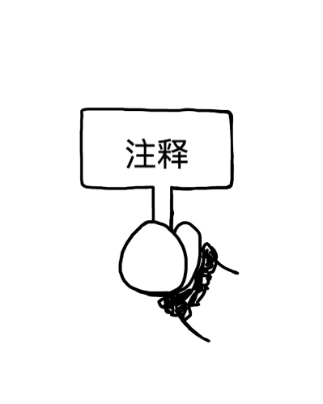

# GAB

> graphical assembly basis 

## the basic 

elements of assembly language

- instruction

- quasiinstruction

- tag

- comment

## doc

[chinese doc](README-CN.md)

## code chapter

### [section1](./section1)

- [function-call.c](./section1/function-call.c) 

- [function-call1-craft.s](./section1/function-call1-craft.s) 
